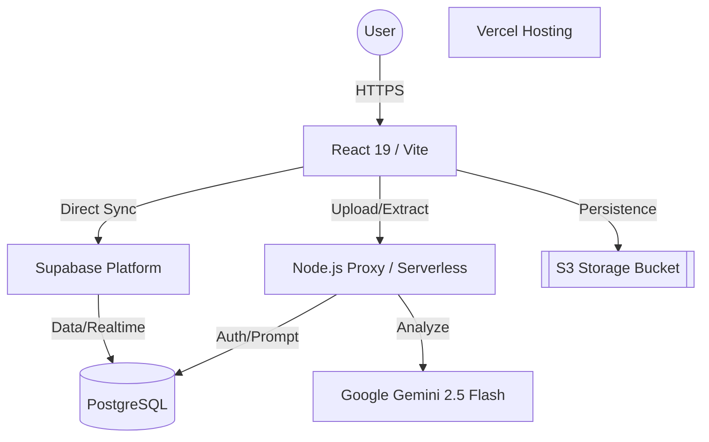

# Technical Architecture: DCBI Expense Tool

This document outlines the system architecture for the DCBI Expense Tool in preparation for Vercel deployment and enterprise auditing.

## 🏗️ System Overview

The application follows a **Decoupled Frontend-Auth-AI** architecture, leveraging serverless principles for scalability and low maintenance.

---

## 💻 1. Frontend Layer (React + Vite)
- **Framework**: React 19 (SPA).
- **Styling**: Vanilla CSS (Premium Glassmorphism Design System).
- **State Management**: React `useState` / `useEffect` with optimistic UI updates.
- **Communication**: 
  - **Supabase JS SDK**: For direct CRUD, Realtime subscriptions, and Storage.
  - **Fetch API**: For calling the AI extraction proxy.

## ⚙️ 2. Logic Layer (Node.js Proxy)
- **Technology**: Express.js.
- **Role**: Secure bridge to the Gemini API.
- **Workflow**:
  1. Receives binary image via `multer` (Memory storage).
  2. Fetches dynamic prompt configurations from Supabase `ai_prompts`.
  3. Computes `file_hash` for duplicate detection.
  4. Proxies request to Gemini with strict JSON Schema enforcement.
  5. Returns structured extraction data + `raw_json` for audit.

## 📊 3. Data & Storage Layer (Supabase)
- **Postgres DB**: Relational storage for Entities, Users, Claims, and Expense Items.
- **Realtime**: Uses Postgres CDC (Change Data Capture) to sync approval statuses across browser tabs.
- **Storage**: `receipts` bucket for public/private file hosting of receipts and bank statements.
- **RLS (Row Level Security)**: Plans to enforce tenant-level isolation at the database layer.

## 🤖 4. AI Engine (Google Gemini)
- **Model**: `gemini-2.5-flash`.
- **Capability**: Multimodal OCR + Semantic JSON extraction.
- **Configuration**: Strict Temperature (0.1) for deterministic financial data output.

---

## 🚀 Vercel Deployment Considerations

### Project Structure
Vercel recognizes the root directory. For the current setup, we will configure:
- **Root Directory**: `./`
- **Output Directory**: `client/dist` (Build command: `cd client && npm run build`)
- **Serverless Functions**: Move `server/index.js` logic to `/api/extract.js`.

### Required Environment Variables
| Variable | Source | Purpose |
| :--- | :--- | :--- |
| `VITE_SUPABASE_URL` | Supabase Settings | Frontend Connection |
| `VITE_SUPABASE_ANON_KEY` | Supabase Settings | Frontend API Access |
| `GEMINI_API_KEY` | Google AI Studio | Backend AI Extraction |
| `SUPABASE_SERVICE_ROLE_KEY` | Supabase Settings | Backend Admin Access (Prompts) |
